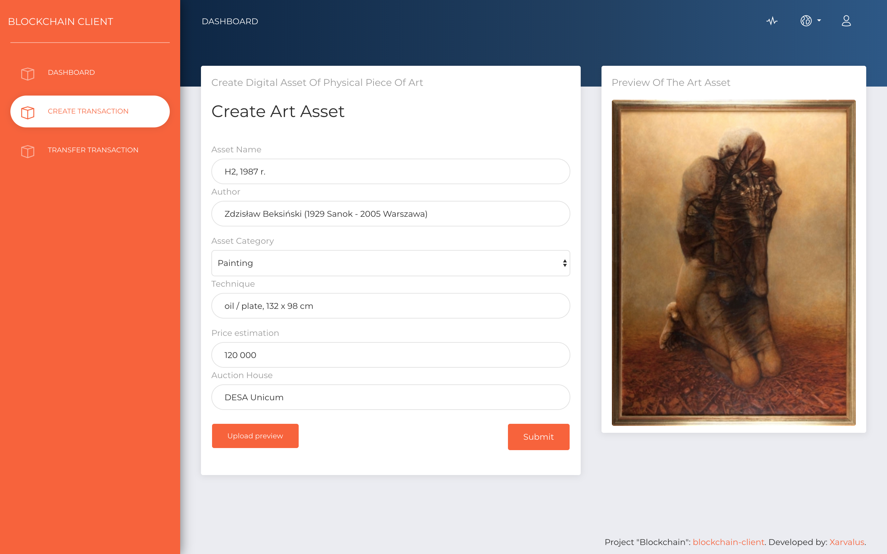

## Blockchain Client

Proof of Concept of business blockchain node network. Handcrafted thanks to [BigchainDB](https://github.com/bigchaindb).



#### Disclaimer - State: PoC
App consists of many elements, mostly unfinished, provided just in purpose of legitimating proposed Proof of Concept functionality.

### Solution concept
Build on [react-boilerplate](https://github.com/react-boilerplate/react-boilerplate) with [NextJS](https://github.com/zeit/next.js) as complete solution for Server Side Rendering w/ battle tested react.


- React + Redux, Saga, React Router 4,
- Reselect, ImmutableJS,
- SSR w/ NextJS (Node),
- PWA ready,
- *GraphQL* [unaccomplished],
- *SocketIO* [unaccomplished],
- Flow,
- Styled Components,
- Jest testing,

With [Now UI Dashboard](https://github.com/creativetimofficial/now-ui-dashboard) theme.

## Installation

```bash
yarn install
```

## Development

```bash
yarn start
```
